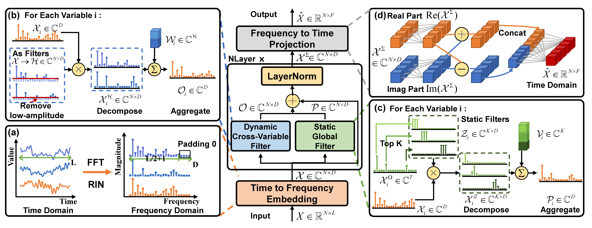
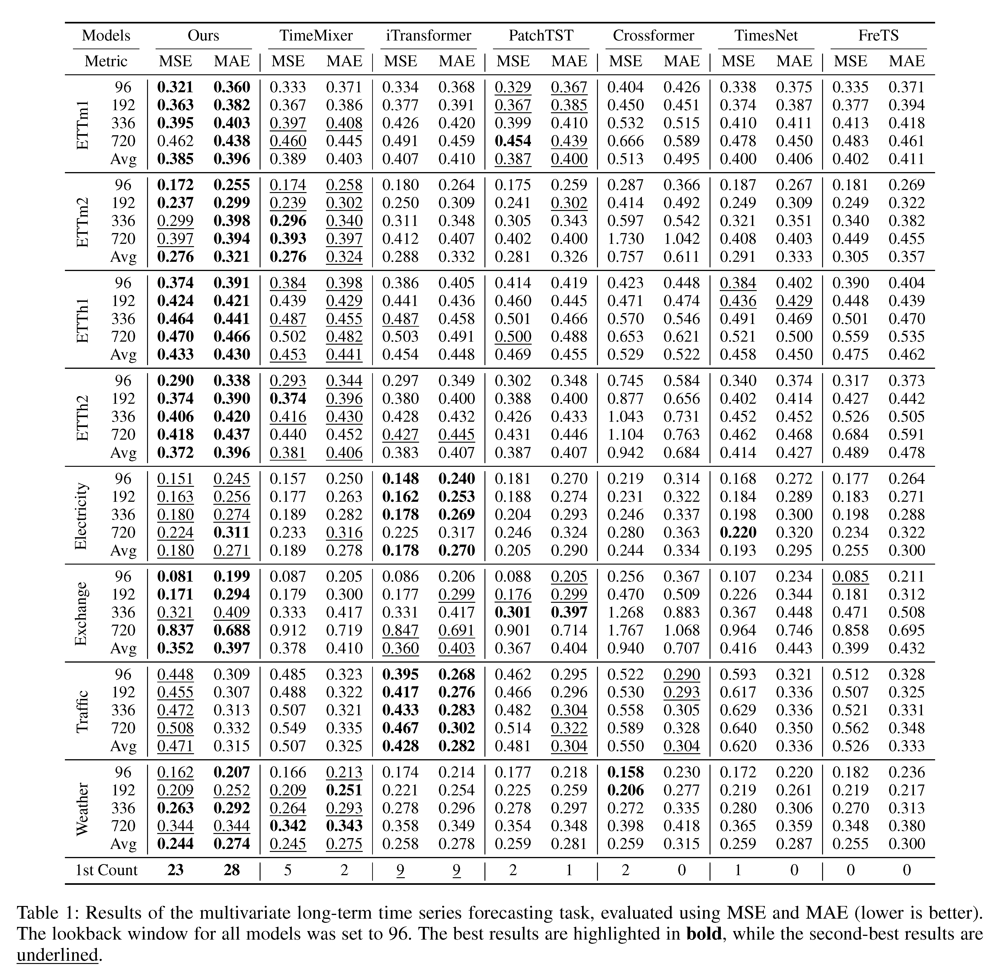

# FilterTS
The code for **FilterTS: Comprehensive Frequency Filtering for Multivariate Time Series Forecasting**



## Get Started
### Installation
Please install the corresponding version of PyTorch via the official PyTorch website, then follow these steps to set up your environment.
```bash
pip install -r requirements.txt
```

### Download the Dataset
Download the dataset from the following [link](https://drive.google.com/file/d/1l51QsKvQPcqILT3DwfjCgx8Dsg2rpjot/edit) and place it in the `./dataset/` directory.
(Please note, this dataset download link is provided by the author of iTransformer and is not associated with any author's address)

## Training Scripts
Run the shell script in the `./scripts` folder, using the following command, for example:
```bash
sh ./scripts/FilterTS_electricity.sh
```

## Main Experimental Results


FilterTS demonstrates superior accuracy across eight multivariate long-term time series forecasting datasets compared to current state-of-the-art models in most cases. 